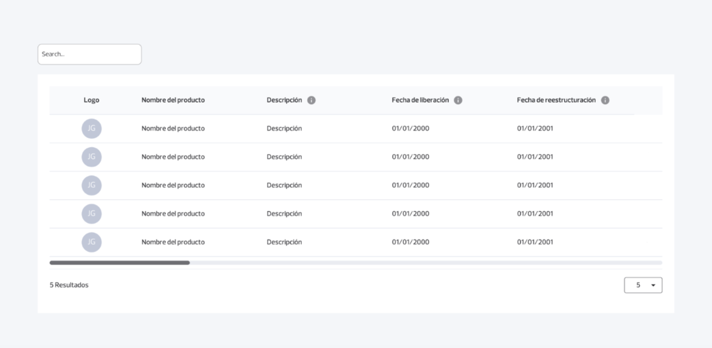
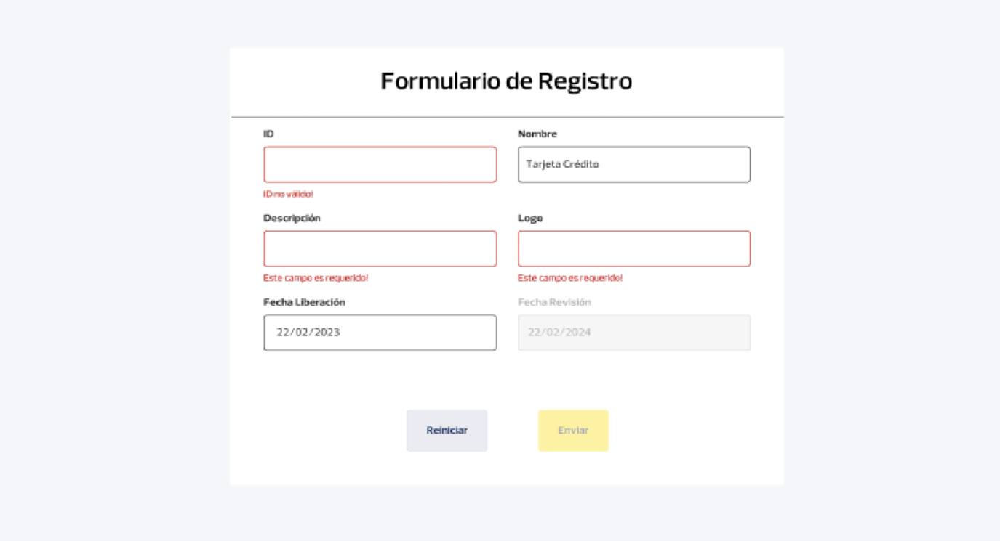
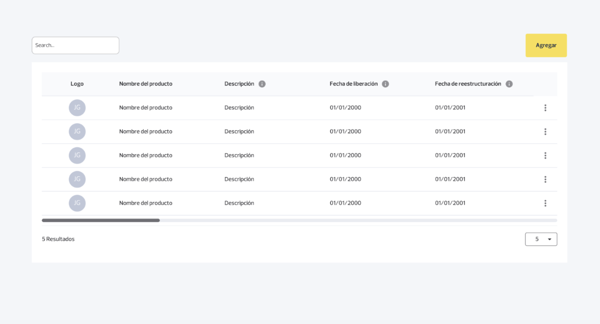
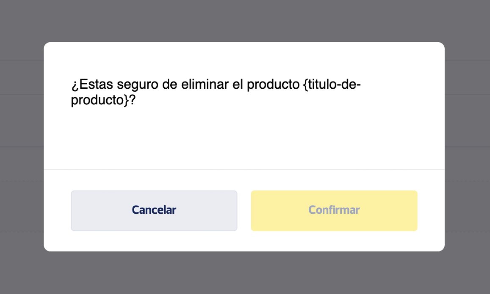

# Guía de maquetación

## Propósito del documento

Definir una guía visual y estructural para implementar la maquetación basada en los diseños D1, D2, D3 y D4 mencionados en `reto.md`, sin escribir todavía código Angular ni componentes concretos.

## Alcance de esta guía

| Diseño | Alcance funcional relacionado |
|---|---|
| D1 | F1 Listado, F2 Búsqueda, F3 Cantidad de registros |
| D2 | F4 Agregar producto y F5 Editar producto |
| D3 | Botón principal `Agregar` y menú contextual por producto |
| D4 | Modal de confirmación para F6 Eliminar producto |

D1

D2

D3

D4

## Principios visuales base

Todos los siguientes puntos son `decisión técnica propuesta` porque `reto.md` exige maquetación basada en diseños, pero no detalla tokens visuales ni sistema de diseño.

| Principio | Aplicación |
|---|---|
| Claridad visual | Priorizar lectura de datos, jerarquía y estados de error visibles |
| Consistencia | Repetir criterios de espaciado, tipografía y acciones entre pantallas |
| Simplicidad | Evitar adornos que desvíen del flujo funcional del reto |
| Accesibilidad básica | Mantener contraste legible, foco visible y mensajes entendibles |
| Estilos propios | No usar frameworks de estilos ni componentes prefabricados |

## Guía para D1

### Objetivo visual

Representar una pantalla principal de consulta de productos financieros con búsqueda, contador de resultados, selector de cantidad y tabla o listado principal.

### Estructura sugerida

| Zona | Contenido esperado |
|---|---|
| Encabezado superior | Título o contexto de la pantalla |
| Barra de acciones | Campo de búsqueda y botón `Agregar` |
| Área de resultados | Tabla o listado con productos |
| Pie del listado | Cantidad de resultados y selector `5`, `10`, `20` |

### Prioridades de maquetación

- Dar protagonismo al listado.
- Mantener visible el campo de búsqueda.
- Hacer identificable el botón principal `Agregar`.
- Mostrar la cantidad de registros sin ambigüedad.

### Estados visuales a contemplar

| Estado | Necesidad |
|---|---|
| Cargando | `decisión técnica propuesta` deseable |
| Sin resultados | Recomendable para búsqueda o respuesta vacía |
| Error de carga | Requisito alineado con manejo visual de errores |

## Guía para D2

### Objetivo visual

Representar el formulario de producto financiero para crear y editar.

### Estructura sugerida

| Zona | Contenido esperado |
|---|---|
| Encabezado del formulario | Título de alta o edición |
| Cuerpo del formulario | Campos `id`, `name`, `description`, `logo`, `date_release`, `date_revision` |
| Área de validaciones | Mensajes de error visibles por campo |
| Pie de acciones | Botón principal y botón `Reiniciar` |

### Reglas de presentación

- El orden de campos debe facilitar lectura y carga.
- Los errores deben mostrarse cerca del campo afectado.
- La `Fecha de revisión` debe presentarse con nomenclatura consistente frente a `date_revision`.
- En modo edición, el campo `id` debe verse deshabilitado de forma clara.

### Estados visuales a contemplar

| Estado | Necesidad |
|---|---|
| Formulario inicial | Sí |
| Formulario con errores | Sí |
| Envío en progreso | `decisión técnica propuesta` |
| Éxito posterior al guardado | `decisión técnica propuesta` |

## Guía para D3

### Objetivo visual

Resolver la ubicación del botón principal `Agregar` y el menú contextual de acciones por producto.

### Botón principal `Agregar`

| Aspecto | Guía |
|---|---|
| Ubicación | Debe ser visible en la pantalla principal |
| Jerarquía | Debe destacar como acción primaria |
| Relación funcional | Debe llevar al formulario de alta |

### Menú contextual por producto

| Aspecto | Guía |
|---|---|
| Ubicación | Asociado claramente a cada fila o tarjeta de producto |
| Contenido mínimo | Opción `Editar` si se implementa F5 |
| Contenido opcional | Opción `Eliminar` si se implementa F6 |
| Comportamiento | Debe ser claro cuál producto está siendo afectado |

### Consideraciones visuales

- Evitar que el menú tape información crítica del producto.
- Mantener coherencia entre acciones primarias y secundarias.
- Diferenciar visualmente acciones destructivas si se incorpora `Eliminar`.

## Guía para D4

### Objetivo visual

Representar el modal de confirmación para eliminar un producto.

### Estructura sugerida

| Zona | Contenido esperado |
|---|---|
| Título o mensaje principal | Confirmación de eliminación |
| Contexto | Referencia clara al producto afectado si se decide mostrarla |
| Acciones | Botón `Cancelar` y botón `Eliminar` |

### Reglas de interacción visual

- `Cancelar` debe leerse como acción secundaria.
- `Eliminar` debe destacarse como acción destructiva.
- El modal debe captar la atención sin ocultar el sentido de la acción.

### Alcance

F6 es opcional para perfil SemiSenior, por lo que D4 no debe priorizarse antes de cerrar F1 a F4.

## Recomendaciones transversales de maquetación

| Tema | Recomendación |
|---|---|
| Espaciado | Mantener ritmos consistentes entre bloques y controles |
| Tipografía | Priorizar legibilidad por encima de estilo decorativo |
| Inputs | Alinear tamaños y estados de foco, error y deshabilitado |
| Mensajes de error | Usar texto claro y ubicación consistente |
| Responsive | `reto.md` lo marca como deseable, no como bloqueo inicial |

## Qué no resolver en esta etapa

- Código Angular de componentes.
- Implementación concreta de estilos.
- Tokens finales de color o tipografía no exigidos por `reto.md`.
- Microinteracciones avanzadas no necesarias para cumplir el reto.

## Notas para implementación

- Usar esta guía como referencia previa a construir componentes y estilos propios.
- Mantener la nomenclatura visible `Fecha de revisión` para el campo `date_revision`.
- Priorizar fidelidad funcional a D1, D2, D3 y D4 antes de sumar refinamientos opcionales.
